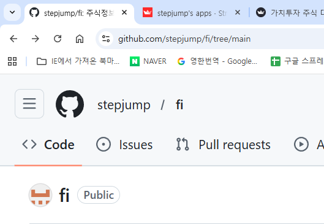
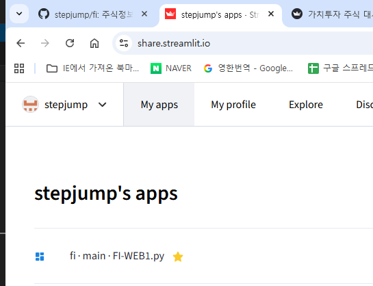
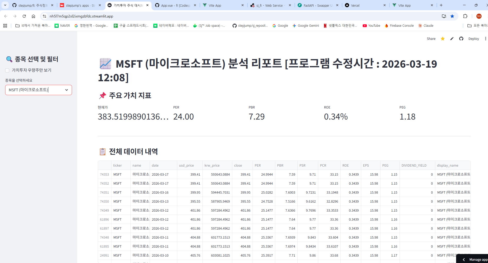
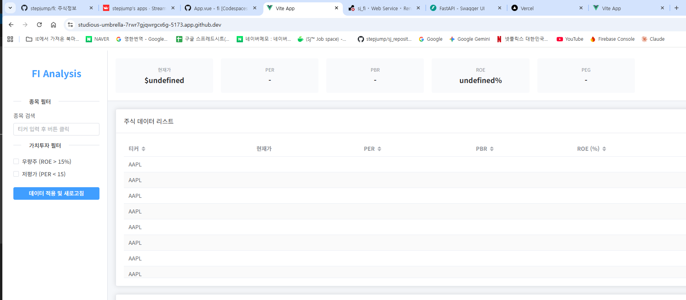
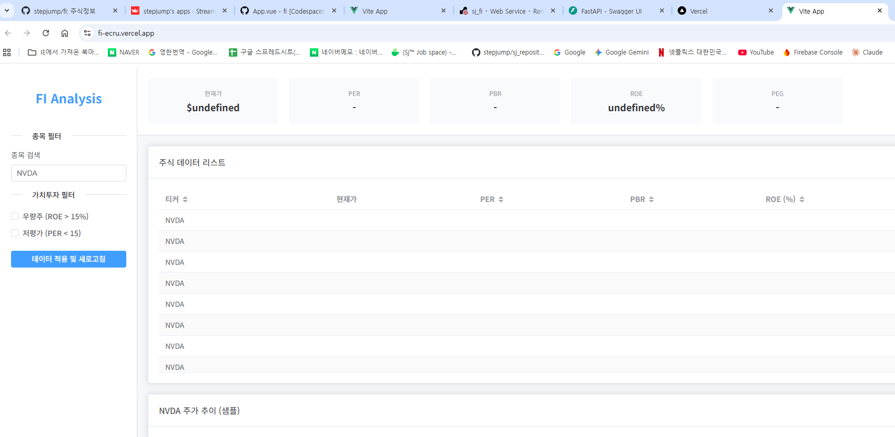

==========================================================================
# fi  주식정보   (https://share.streamlit.io/)  파이썬 배포 streamlit 이용
==========================================================================

개발사이트 ===> https://nh5l7m5qp2xl2ixmgzbfdc.streamlit.app/

백엔드 Swagger목록 ===> https://studious-umbrella-7rwr7gjqwrgcx6g-8000.app.github.dev/docs#

==========================================================================

[GitHub]

stepjump/fi 

[CODESPACES 에서 로컬 실행 - 파이썬 FI-WEB1.py]

[CODESPACES 에서 백엔드 실행]

@stepjump ➜ /workspaces/fi/fi-frontend (main) $ npm run dev

[vercel.com 에서 프론트엔드 실행]

https://vercel.com/hyoung-buem-koos-projects

